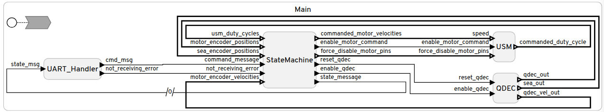

# MRIRobot_Firmware
Code for STM32 and basic python interface, including LinguaFranca and Zephyr



## About 
This code is written for a STM32 f466re that's mounted onto a custom PCB that enables communication with an FPGA and 7 Tekceleo control boards. Much of the hardware-facing parts of this code are very application specific, but high level concpets and patterns could transfer to other projects.

## Setup Instructions

### Setup Wizard
This process **should** be automated for Ubuntu by the setup wizard.
``` # bash
chmod +x setup_wizard.sh
chmod +x prescalar_patch.sh
./setup_wizard.sh
```
However, if it doesn't work for some reason please see the manual setup instructions.

### Manual Instructions
This code was designed to be used with a specific checkout of the [stm32_2](https://github.com/lf-lang/lingua-franca/tree/stm32_2#) branch of the [Lingua Franca](https://github.com/lf-lang/lingua-franca) repository.

To get the repo with the right checkout, run:
``` # bash
cd resources
git clone -b stm32_2 https://github.com/lf-lang/lingua-franca.git
cd lingua-franca
git checkout 60d9eacaa5ceb17587a3118e86d15e99b258b679
git submodule update --init --recursive
./prescalar_patch.sh
./gradlew assemble
```

Then add the binaries to your path by appending this to your .bashrc file (assuming you're using Ubuntu and git clone was run in your home directory) to be able to run the make files correctly.
```
export PATH="$PATH:~/{path-to-this-repo}/resources/lingua-franca/bin"
```

To install the required compiler, run:
> sudo apt install gcc-arm-none-eabi

Lastly, you will need to make sure that [OpenOCD](https://openocd.org/) is in the resources folder before flashing to the STM32.

Add it to the resources folder by changing the directory to /resources and then cloning the repository
```
cd resources
git clone https://github.com/openocd-org/openocd.git
```

## Build and Flash Instructions
To build the main working version of **vel_control_mri_arm**, run:
```
cd vel_control_mri_arm
make build_dev
```
Then to flash the built code, run
```
make just_flash
```
Or to build and then flash in one line, run
```
make flash
```

### Not Flashing?
If flashing fails, it's likely due to the tty port not being allowed or the STM32 is not plugged in or powered.

If it's the tty, it's usually on dev/tty/AMC0 but it can change.
To allow it, run this with the correct Superuser permissions and then try again.
```
sudo chmod 777 /dev/tty/ACM0
```

### Prescalar Patch
The prescalar_patch.sh is a patch onto the Lingua Franca STM32 support code makes sure timer 5 (TIM5) has the correct prescalar (TIM5->PSC) value set so that Lingua Franca's timing alings with the real world clock time. If this isn't included, the system will not run correctly and show a small army of odd bugs and mysterious behaviors that are hard to track down.

Make sure it's run and the patch is applied before running ./gradlew assemble